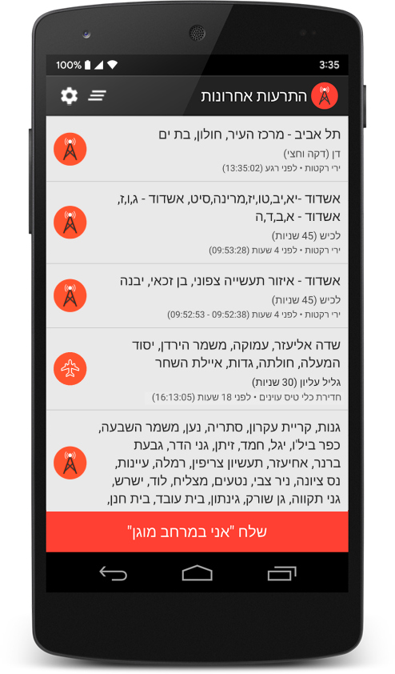
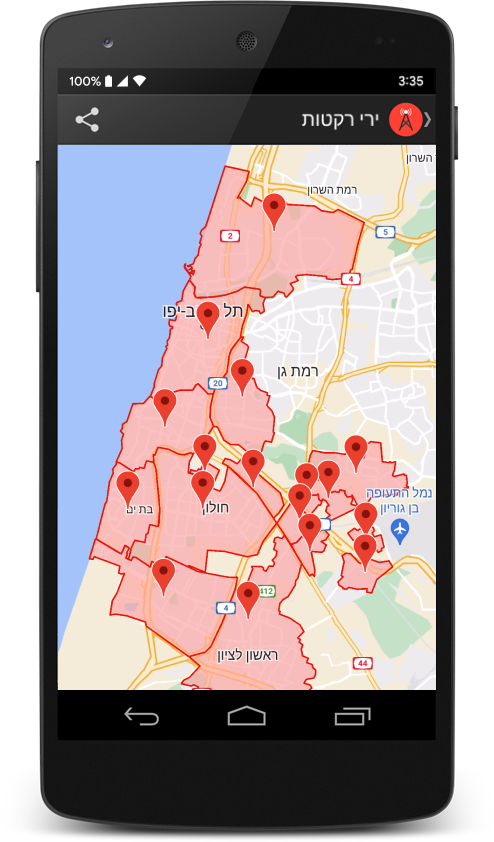

<h1>  NYPrepper Emergency Alert System for Android</h1>

NYPrepper Emergency Alert System was developed by volunteers to provide real-time emergency alerts for Israeli citizens.

* [Official Site](https://www.newyorkprepper.com/)
* [Google Play Listing]() SOON
* [Android APK Download]() SOON

The app relays real-time safety alerts published by the Home Front Command (Pikud Haoref) using the [pikud-haoref-api](https://github.com/eladnava/pikud-haoref-api) Node.js package.

## Screenshots

 

## Features

#### The fastest, most reliable nuclear emergency alert app.

* Speed & reliability - alerts are received before / during the official siren thanks to dedicated notification servers
* Location-based alerts - receive emergency alerts on the move in addition to city / region selection
* Threat types - receive alerts about rocket fire, hostile aircraft intrusion, terrorist infiltration, and more
* Alert history - see the list of recent alerts, their location, and time of day (in your local time)
* Connectivity test - check, at any time, whether your device is able to receive alerts via the "self-test" option
* Sound selection - choose from 15 unique sounds for alerts or choose a custom sound
* Silent mode override - the application will override silent / vibrate mode to sound alerts
* Vibration - your phone will vibrate in addition to playing the selected alert sound
* Area selection - select preferred alert cities / regions by searching for them
* Countdown - alerts will display the estimated time until impact
* I'm safe - let your friends and family know you are safe by sending an "I'm safe" message via the app
* Localization - the app has been translated to multiple languages (Hebrew, English, Arabic, Russian, Italian, Spanish, French, German, and Portuguese)

## Requirements
* Android SDK
* Android Studio with Gradle Plugin
* A physical device to test on (recommended) running Android 2.3+ with Google APIs (optional)

## Collaborating

* If you find a bug or wish to make some kind of change, please create an issue first
* Make your commits as tiny as possible - one feature or bugfix at a time
* Write detailed commit messages, in-line with the project's commit naming conventions
* Make sure your code conventions are in-line with the project

## Special Thanks

* Thanks to eladnava for building the original Red Alert app this is forked from.

## License

Apache 2.0
